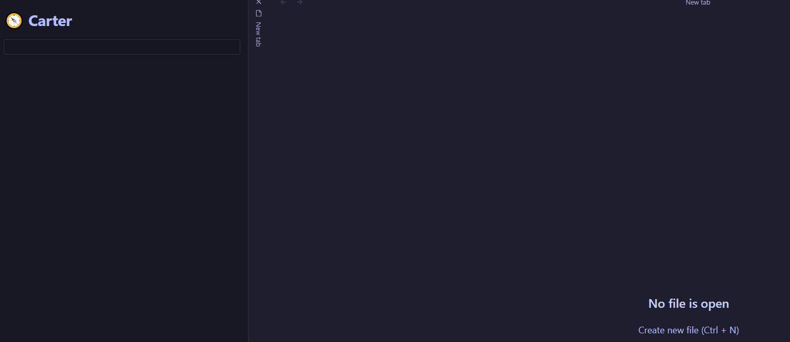

**Note the project is still a WIP and we take no responsibility for any problems you may face. The frontmatter of markdown files will be changed for virtually all notes.**

# 🔮 Enter the Arcana

> A plugin for [Obsidian](https://obsidian.md/)

**Arcana** is a collection of AI powered tools designed to help you be more creative and productive with your Obsidian vault. Each tool is inspired by a famous historical figure:

- [Socrates](#socrates) - **Conversation**
- [Agatha Christie](#agatha-christie) - **Text Generation**
- [Richard Feynman](#richard-feynman) - **Flashcard Generation**
- [Charles Darwin](#charles-darwin) - **Auto Tagging**
- [Nostradamus](#nostradamus) - **Note Naming**
- [Howard Carter](#howard-carter) - **Smart Search** (_not available_)

## Usage:

- (This plugin is not yet available on the obisidan plugin marketplace.)
- **OpenAI API key required** - set in settings.
- Most tools are invoked using the command palette and searching either `Arcana` or the person's name.
- Some tools add a view in the sidebar to interact with.

## Etymology:

> The word arcanum (pluralized as "arcana") came from Latin arcanus, meaning "secret," and entered English as the Dark Ages gave way to the Renaissance. It was often used in reference to the mysteries of the physical and spiritual worlds, subjects of heavy scrutiny and rethinking at the time.

# The Keepers of the Arcana:

## Socrates

**The Socratic Method with Socrates**

## Agatha Christie

- Anywhere in a note, you can ask Agatha to write for you (either by asking a question or giving an instruction)
- She will use your note as a guide.
- You can also highlight text and Agatha will also take that into consideration. (She will write instead at the **bottom of the file**)
- To cancel your request, press `Esc`.

## Richard Feynman

**Write Flashcards with Feynman**

- Will take a note and produce 5 flashcards for you to use.
- Flashcards are capatible with [Obsidian-Spaced-Repitition](https://github.com/st3v3nmw/obsidian-spaced-repetition) plugin.
- Category is also generated.

## Charles Darwin

**Cataloging and Classifying**

- Adds 2-5 tags to your note in the frontmatter
- Tries to use tags the user has used in other notes
- Does not repeat tags used in the note.
- Tags are in kebab lower case

## Nostradamus

**Can predict the title of notes**

- Takes the content of the note and uses it to give the file a better title.
- Does it in the style of [Andy Matuschak's Evergreen notes](https://notes.andymatuschak.org/Evergreen_note_titles_are_like_APIs)

## Howard Carter

**Rediscovering the Past**

- **Smart Search** your vault that goes beyond token matching and instead searches based on meaning.
- Each note has an embedding (periodically cached)
- The search finds the notes whose embeddings are closest to the search query.

_At the moment, the Carter plugin is unavailable and will likely be removed in the future_

---

### Contributing:

If you would like to contribute or collaborate, message me directly on twitter [@AFV_7](https://twitter.com/AFV_7) and we can talk :).

---

_The images were generated using Midjourney_
