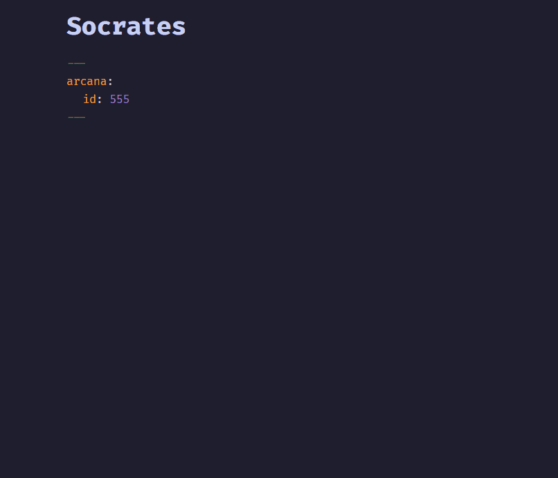
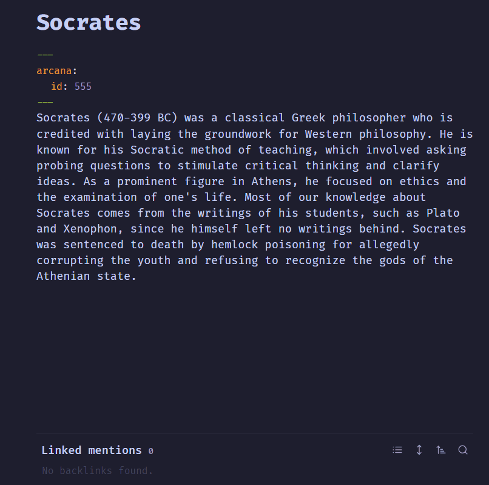

**Note the project is still a WIP and we take no responsibility for any problems you may face. The frontmatter of markdown files will be changed for virtually all notes.**

# 🔮 Enter the Arcana

> A plugin for [Obsidian](https://obsidian.md/)

**Arcana** is a collection of AI powered tools designed to help you be more creative and productive with your Obsidian vault. Each tool is inspired by a famous historical figure:

- [Socrates](#socrates) - **Question Answering**
- [Richard Feynman](#richard-feynman) - **Flashcard Generation**
- [Nostradamus](#nostradamus) - **Note Naming**
- [Christopher Columbus](#christopher-columbus) - **Smart Search**
- [Agatha Christie](#agatha-christie) - **Section Completion**

## Usage:

- **OpenAI API key required** - set in settings.
- Most tools are invoked using the command palette and searching either `Arcana` or the person's name.
- Some tools add a view in the sidebar to interact with.

## Etymology:

> The word arcanum (pluralized as "arcana") came from Latin arcanus, meaning "secret," and entered English as the Dark Ages gave way to the Renaissance. It was often used in reference to the mysteries of the physical and spiritual worlds, subjects of heavy scrutiny and rethinking at the time.

# The Keepers of the Arcana:

## Socrates

**The Socratic Method with Socrates**

- Anywhere in a note, you can ask a question to Socrates. He will answer, writing where your cursor was.
- He will use your note as a guide for answering your question.
- You can also highlight text and Socrates will also take that into consideration. (He will write instead at the **bottom of the file**)
- You can even give him instructions.
- To cancel your question, press `Esc`.
  
  

## Richard Feynman

**Write Flashcards with Feynman**

- Will take a note and produce 5 flashcards for you to use.
- Flashcards are capatible with [Obsidian-Spaced-Repitition](https://github.com/st3v3nmw/obsidian-spaced-repetition) plugin.
- Category is also generated.

## Nostradamus

**Gives a better name for the note**

## Christopher Columbus

**Smart Search** (WIP)

## Agatha Christie

**Writes sections**

- Give Christie the section header and she will write the text for you.
- She will try not to repeat what has already been said.
- Using smaller headers (`#` vs `##` etc) will write less and be more succinct.  

---

### Contributing:

If you would like to contribute or collaborate, message me directly on twitter [@AFV_7](https://twitter.com/AFV_7) and we can talk :).

---

_The images were generated using Midjourney_
