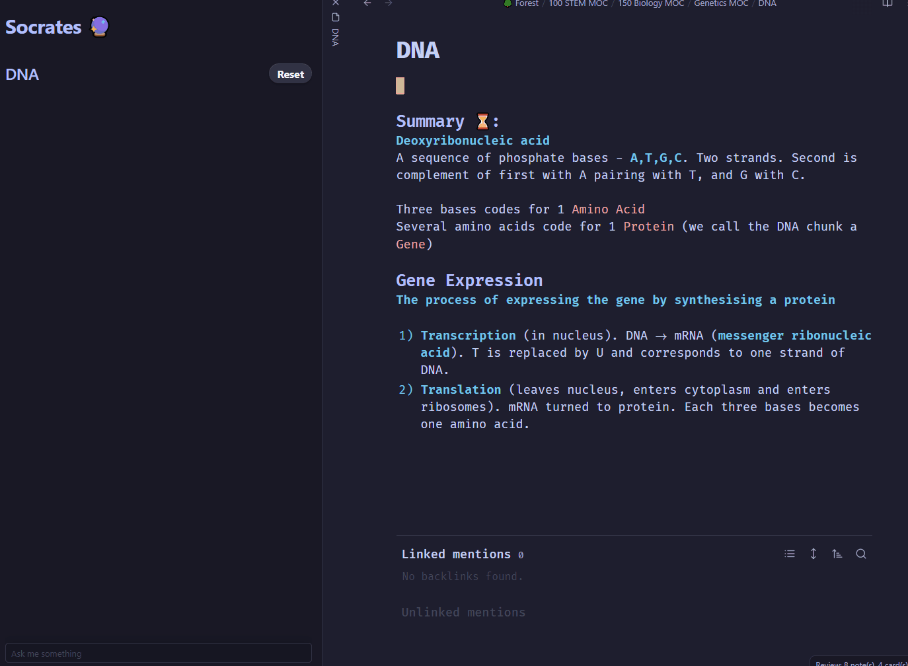

[](https://www.buymeacoffee.com/AFV7)


[Looking for Collaborators](#collaborating)

# 🔮 Arcana

> A plugin for [Obsidian](https://obsidian.md/)

**Arcana** is a collection of AI powered tools designed to help you be more creative and productive with your Obsidian vault. Each tool is inspired by a famous historical figure:

- [Socrates](#socrates) - **Conversation**
  - [Custom Agents](#adding-custom-chat-agents) - **Create Conversation Agents from Templates**
- [Agatha Christie](#agatha-christie) - **Text Generation**
- [Richard Feynman](#richard-feynman) - **Flashcard Generation**
- [Charles Darwin](#charles-darwin) - **Auto Tagging**
- [Nostradamus](#nostradamus) - **Note Naming**

## Usage:

- **[OpenAI API key](https://platform.openai.com/account/api-keys) required** - set in settings.
- **It is highly recommended that you use the GPT4 API instead of the GPT3.5.**
- Most tools are invoked using the command palette and searching either `Arcana` or the person's name.
- Some tools add a view in the sidebar to interact with.

## Etymology:

> The word arcanum (pluralized as "arcana") came from Latin arcanus, meaning "secret," and entered English as the Dark Ages gave way to the Renaissance. It was often used in reference to the mysteries of the physical and spiritual worlds, subjects of heavy scrutiny and rethinking at the time.

# The Keepers of the Arcana:

## Socrates

<p align="center">

</p>

**The Socratic Method with Socrates**

- Exchange in dialogue with Socrates.
- Ask questions specific to the note currently open.



### Adding Custom Chat Agents

You can create new agents like Socrates that are specialized for your own use cases.

For example, bring **Aristotle**, the teacher of Alexander the Greater, to life by using [Mr Ranedeer's AI Tutor Prompt](https://github.com/JushBJJ/Mr.-Ranedeer-AI-Tutor) as the initial message.

To create a new agent, add a new file to the `Conversation Agent Folder` specified in settings.

1. The agent's **name** is the name of the file. Names must be unique and cannot be the same as **Socrates**
2. The agent's **initial message** is the body of the file.
3. For additional agent settings, you can add the following fields to the file's YAML frontmatter:

| Setting ID                  | Setting Type | Description                                                       |
| --------------------------- | ------------ | ----------------------------------------------------------------- |
| `arcana-agent-emoji`        | Emoji        | The emoji the agent will use for the conversation                 |
| `arcana-user-emoji`         | Emoji        | The emoji the user will use for the conversation                  |
| `arcana-auto-send-transcription` | Boolean      | Whether to send a transcribed message immediately after recording |

[This website](https://flowgpt.com/) provides some good prompts for making agents.

#### Example

In a file called `Aristotle.md`

```md
---
arcana-user-emoji: 🧐
arcana-agent-emoji: 🗿
arcana-auto-send-transcription: true
---

I want you to act like Aristotle.
I want you to respond and answer like Aristotle using the tone, manner and vocabulary Aristotle would use.
Do not write any explanations.
Only answer like Aristotle. You must know all of the knowledge of Aristotle.
```

## Agatha Christie

<p align="center">

</p>

- Anywhere in a note, you can ask Agatha to write for you (either by asking a question or giving an instruction)
- She will use your note as a guide.
- You can also highlight text and Agatha will also take that into consideration. (She will write instead at the **bottom of the file**)
- To cancel your request, press `Esc`.


## Richard Feynman

<p align="center">

</p>

**Write Flashcards with Feynman**

- Will take a note and produce 5 flashcards for you to use.
- Flashcards are capatible with [Obsidian-Spaced-Repitition](https://github.com/st3v3nmw/obsidian-spaced-repetition) plugin.
- Category is also generated.


## Charles Darwin

<p align="center">

</p>

**Cataloging and Classifying**

- Adds 1-4 tags to your note in the frontmatter
- Only uses tags that are in your vault.
- Does not repeat tags used in the note.


## Nostradamus

<p align="center">

</p>

**Can predict the title of notes**

- Takes the content of the note and uses it to give the file a better title.
- Does it in the style of [Andy Matuschak's Evergreen notes](https://notes.andymatuschak.org/Evergreen_note_titles_are_like_APIs)


---

### Collaborating:

**Actively Looking for Collaborators**
If you would like to contribute or collaborate, message me directly on twitter [@AFV_7](https://twitter.com/AFV_7) and we can talk :).

---

_The images were generated using Midjourney_
